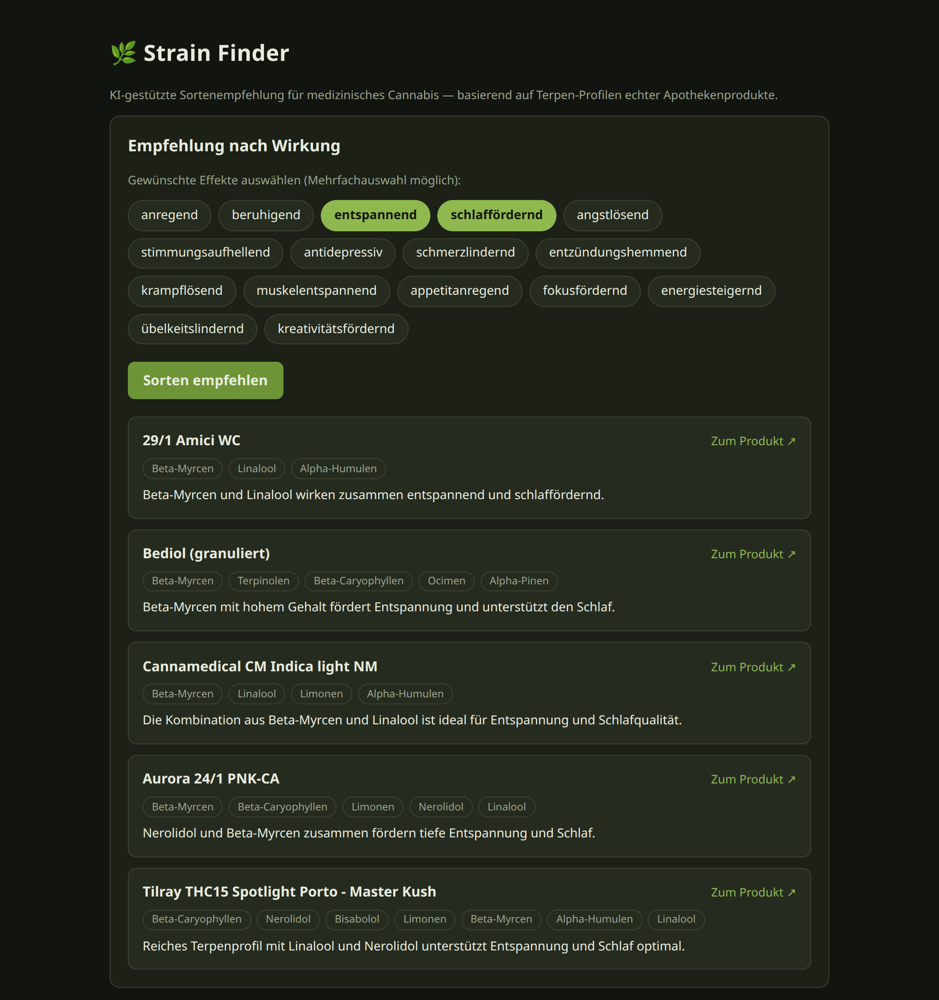

# 🌿 Strain Finder

AI-powered strain recommendations for medical cannabis, grounded in real
terpene data. A small full-stack showcase for **production-minded LLM
integration**: Vue 3 + Vite frontend, Express backend proxying the
**Claude API** (Anthropic SDK) with structured outputs, prompt caching and
streaming.

> **Demo project.** This is a standalone extract of a single feature from a
> larger production app I built and shipped (a cannabis social club platform —
> Quasar/Capacitor + Node/Socket.IO). It exists purely to demonstrate how I
> integrate LLM APIs; it is not a product and not intended for real-world use.
> UI language is German, matching the original user base.



## What it does

- **Effect-based recommendations** — pick desired effects (e.g. *entspannend*,
  *schmerzlindernd*); Claude selects matching strains from a dataset of ~200
  real pharmacy products with scraped terpene profiles and explains each match.
- **Live chat** — a domain-scoped assistant for questions about cannabis and
  terpenes, streamed token-by-token to the browser.

## Architecture

```
┌─────────────┐   /api/effects            ┌──────────────┐   Messages API   ┌───────────┐
│  Vue 3 SPA  │   /api/recommend  ──────► │   Express    │ ───────────────► │  Claude   │
│   (Vite)    │   /api/chat (SSE) ◄────── │    proxy     │ ◄─── streaming ─ │(Haiku 4.5)│
└─────────────┘                           └──────┬───────┘                  └───────────┘
                                                 │
                                          terpenes.json
                                     (~200 products, cached
                                      in the prompt prefix)
```

## Design decisions

**API key stays on the server.** The browser never talks to the Claude API.
A common (and dangerous) shortcut is calling LLM APIs directly from the client
— that ships your API key inside the JS bundle, readable by anyone. The
Express proxy keeps the key in `.env`, validates all input, and exposes only
two narrow endpoints.

**Structured outputs instead of prompt-and-parse.** The recommendation
endpoint uses the SDK's `messages.parse()` with a Zod schema
(`output_config.format`). The API guarantees schema-valid JSON — no regex
extraction, no "please respond only with JSON" prompt engineering, no broken
parses.

**Grounding instead of hallucination.** The model doesn't answer from its
training data — it picks from a real product dataset injected into the system
prompt. The server additionally verifies every recommended URL against the
dataset before responding, so a hallucinated product can never reach the UI.

**Prompt caching + warm-up.** The ~50K-token product dataset is a static
prompt prefix marked with `cache_control: {type: "ephemeral"}`. Repeated
requests read it from Anthropic's prompt cache at ~10% of the input price
instead of re-processing it every time. The server pre-warms the cache at
boot so even the first user request skips the cold read. One subtlety worth
knowing: structured-outputs requests have a different cacheable prefix than
plain ones, so the warm-up must send the exact same `output_config.format`.

**Lean model output.** Output tokens dominate LLM latency. The model returns
only what it uniquely contributes — the product URL and a one-sentence
justification; name and terpene profile are enriched server-side from the
dataset. Together with the cache warm-up this cut response time from ~16s to
~4s (and guarantees the displayed data matches the dataset exactly).

**Streaming end-to-end.** Chat responses stream from the Claude API through
the Express server (as server-sent events) into the Vue UI, rendering
token-by-token.

## Getting started

Requires Node.js ≥ 20.6 and an [Anthropic API key](https://platform.claude.com/).

```bash
# 1. Backend
cd server
npm install
cp .env.example .env       # put your ANTHROPIC_API_KEY in .env
npm run dev                # http://localhost:3000

# 2. Frontend (second terminal)
cd client
npm install
npm run dev                # http://localhost:5173, proxies /api to :3000
```

For a single-process deployment, build the SPA and let Express serve it:

```bash
cd client && npm run build   # server serves client/dist automatically
```

## API

| Endpoint | Method | Description |
|---|---|---|
| `/api/effects` | GET | Selectable effects (single source of truth for the UI) |
| `/api/recommend` | POST | `{effects: string[]}` → `{strains: [{name, url, terpenes, reason}]}` |
| `/api/chat` | POST | `{messages: [{role, content}]}` → SSE stream of text deltas |

## Project layout

```
server/
  index.js      Express app: routes, validation, SSE plumbing
  claude.js     All Claude API interaction: schema, prompts, caching
  data/         Terpene dataset (scraped pharmacy products)
client/
  src/App.vue                    Screen composition + recommendation flow
  src/components/EffectPicker    Effect multi-select chips
  src/components/StrainCard      One recommendation result
  src/components/ChatPanel       Streaming chat (SSE reader)
```

## Notes

- Demonstration only — a feature excerpt from a larger app, not a standalone
  product. Expect rough edges outside the showcased flows.
- The dataset is a snapshot for demo purposes; product availability changes.
- This is an informational demo, not medical advice.
- Model defaults to `claude-haiku-4-5` (fast and cheap — plenty for this task);
  override via `ANTHROPIC_MODEL` in `.env`.

## License

[MIT](LICENSE)
